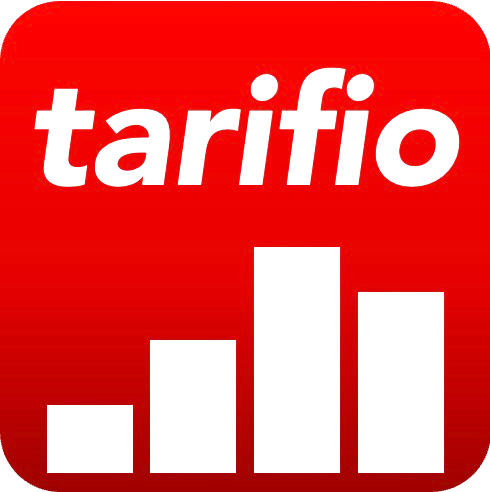

<div align="center">

  

  # *tarifio*
  ### Free Tariff Calculator for Importers and Exporters

  *Built with **GAP OS** using **The Signal Hunter** Framework*

  [](#)
  [](LICENSE)
  [](#)
  [](https://kenangeyyas.substack.com/p/free-tools)

</div>

---

> 🚧 **ACTIVE DEVELOPMENT**
>
> This project is currently in early development phase.  
> Core engine, data models, and UI are under active construction.  
> First stable release will be published soon.

---

## 🧭 Overview

***tarifio*** is an open-source tariff calculation tool designed to simplify global trade decisions for importers and exporters.

It helps users understand the true cost of importing goods by calculating duties, taxes, and related customs charges in a transparent and structured way.

Instead of relying on fragmented tools or manual calculations, Tarifio centralizes tariff intelligence into one simple interface.

> Clear tariffs lead to better trade decisions.

---

## ⚙️ Current State
This project is currently in early build phase.

- Core tariff calculator → In progress  
- UI layer → Prototype stage  
- Data models → Experimental  
- First stable release → Coming soon  

---

## 🧠 What Problem Does It Solve?

International trade cost calculation is often:

- Fragmented across multiple tools  
- Dependent on outdated tariff tables  
- Confusing for small and mid-sized importers  
- Prone to manual calculation errors  

*Tarifio* reduces this complexity by providing a **structured and explainable tariff engine**.

---

## 🏗️ Ecosystem

HA.RS.QO is part of a broader open-source trade intelligence toolkit:

**Kenan Geyyas ➔ GAP OS ➔ The Signal Hunter Framework ➔ Free Tools**

- 🎯 **HA.RS.QO** (`hs-code-classifier`): AI-Powered HS Code Classifier
- 📊 ***tarifio*** (`tariff-calculator`): *You are here*
- ⚖️ **PROVENI** (`fta-rules-of-origin`): Free Trade Agreement compliance verification
- 📦 **Netto** (`landed-cost-calculator`): Landed Cost Calculator to Estimate Total Import Duties, Freight and Sourcing Fees
- 🛡️ **COMPILA** (`supplier-compliance-tool`): Framework for Supplier Compliance Audits, Risk Assessments and Supply Chain Vetting

All tools are being developed under the **GAP OS ecosystem**.

---

## ✨ Planned Features

### Phase 1 — Core Foundation
- Basic tariff calculator  
- Country of origin selection  
- Destination country selection  
- HS code input  
- Product value input  
- Duty calculation engine  
- Responsive UI  

### Phase 2 — Product Maturity
- VAT / GST calculation  
- Duty breakdown visualization  
- Trade agreement detection  
- Multi-currency support  
- Exchange rate integration  
- CSV export  
- Calculation history  
- Bulk calculations  

### Phase 3 — Intelligence & Automation
- Real-time tariff datasets  
- REST API  
- AI-assisted tariff recommendations  
- Country comparison engine  
- Scenario simulation  
- Cost optimization suggestions  
- Community contributions  

### Phase 4 — GAP OS Integration
- Integration with HA.RS.QO (HS Code auto-detection)  
- Integration with Netto (landed cost modeling)  
- Integration with Proveni (FTA validation)  
- Integration with Compila (supplier risk context)  
- Cross-tool workflow engine  
- Unified trade intelligence layer  

---

## 🚀 Getting Started

### Prerequisites
This repository is currently in active development. Codebase structure is being finalized.

### Installation
```bash
git clone https://github.com/kgeyyas/tariff-calculator.git
cd tariff-calculator
```

### 🧠 System Design Philosophy

*tarifio* is built around three principles:

Transparency over hidden calculations
Simplicity over complexity
Decision support over raw computation

The goal is not only to calculate tariffs, but to help users understand why those costs exist.

### 🤝 Contributing

Contributions are welcome after the initial public release.

- Developers
- Trade and customs experts
- Data scientists
- Supply chain professionals

Contributions to improve global trade infrastructure are greatly appreciated.

Please open an issue before submitting major changes.


### 📄 License
This project is licensed under the MIT License. See LICENSE for more information.


### 🔗 About GAP OS

GAP OS (Gap Operating System) is a decision framework for identifying market opportunities, validating signals, and building systems before they become obvious.

The Signal Hunter Framework is the methodology behind GAP OS. It focuses on identifying weak market signals early and transforming them into structured, practical systems and tools.


## 👤 Author

**Kenan Geyyas**  
Building open-source trade intelligence systems with GAP OS.

<p align="left">
  <a href="https://www.linkedin.com/in/kenan-geyyas/">
    
  </a>

  <a href="https://kenangeyyas.substack.com">
    
  </a>

  <a href="https://x.com/k_geyyas">
    
  </a>
</p>

